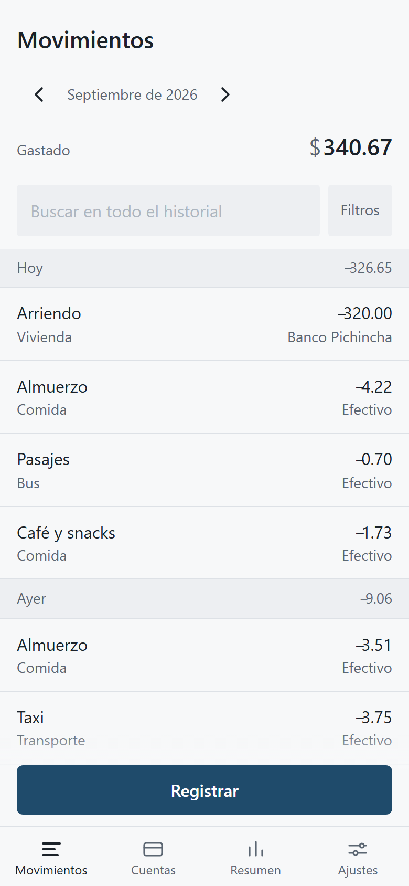
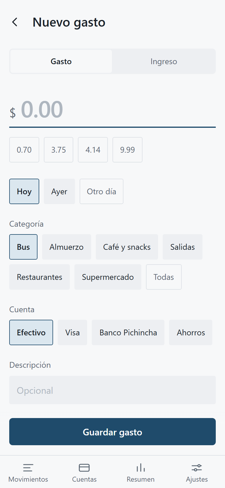
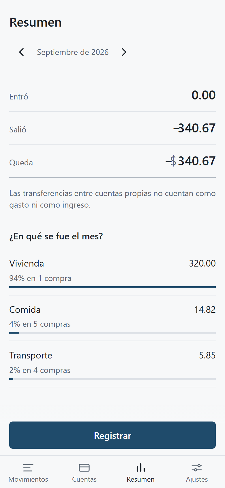
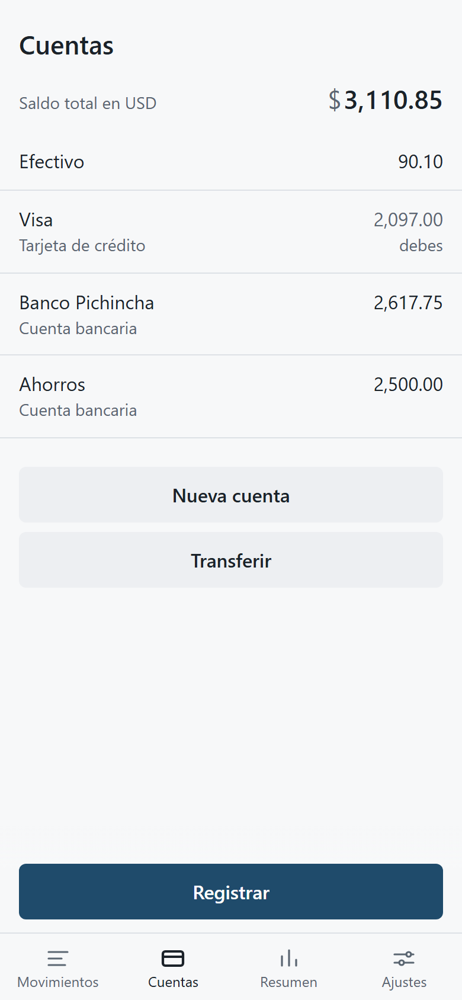
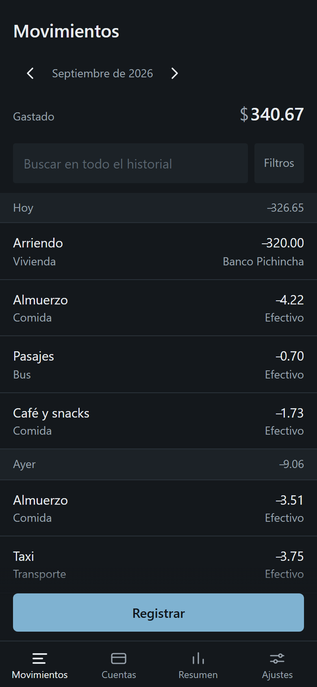

# Saldus

Un libro de cuentas para el bolsillo. Aplicación web progresiva para
anotar ingresos y gastos personales desde el celular, pensada para
Ecuador y USD.

**Funciona sin conexión.** No como una degradación elegante: es el
funcionamiento normal. Todo lo que se ve en pantalla se calcula sobre
una réplica local en IndexedDB, y ninguna escritura espera a la red para
confirmarse.

<p>
  
  
  
</p>

---

## Qué hace

- **Registrar un gasto en dos toques.** El atajo del ícono de la
  pantalla de inicio abre el formulario con el monto enfocado, la fecha
  en hoy, la última cuenta preseleccionada y la categoría más frecuente
  ya elegida. Se teclea el monto y se guarda.
- **Cuentas con saldo vivo**, recalculado desde los movimientos. No
  existe ningún campo `saldo_actual` que se pueda desincronizar.
- **Transferencias entre cuentas propias**, que mueven los dos saldos y
  **no cuentan como gasto**.
- **Categorías en dos niveles** y etiquetas transversales.
- **Resumen del mes**: cuánto entró, cuánto salió, cuánto queda y en qué
  se fue.
- **Importador de CSV** con vista previa en seco: dice cuántas filas
  entran, cuáles se rechazan y por qué, y cuáles parecen repetidas antes
  de escribir nada.
- **Usuario demo** con seis meses de datos de ejemplo, sin credenciales.

---

## Estado

**Fase 1 completa: la app funciona entera contra el dispositivo.** No
hay backend todavía, así que los datos viven solo en el navegador donde
se escriben. La Fase 2 añade el servidor y la sincronización; la
estructura para eso —UUID generados en el cliente, cola de salida,
borrado suave, marcas de `actualizado_en`— ya está escrita.

| Fase | Alcance | Estado |
| --- | --- | --- |
| 1 | PWA local: CRUD completo, resumen del mes, importador de CSV | Terminada |
| 2 | Spring Boot, PostgreSQL en Neon, autenticación y sincronización | Pendiente |
| 3 | Tablero: flujo de caja, variación mensual, gastos hormiga, 50/30/20 | Pendiente |

Entre la Fase 1 y la 2 hay una parada deliberada: usar la app dos
semanas con datos reales antes de escribir el backend, porque varias
suposiciones van a resultar equivocadas y sale más barato descubrirlo
antes de congelarlas en un esquema desplegado.

---

## Cómo se construyó

### Local-first, en serio

La decisión estructural es que **IndexedDB no es una cola de pendientes,
es una réplica completa**. Todas las lecturas, listados y cálculos salen
de ahí. El formulario escribe en el dispositivo y confirma de inmediato;
la sincronización, cuando exista, ocurrirá después y en segundo plano.

Eso tiene una consecuencia que atraviesa el proyecto: **Postgres tiene
CHECKs y claves foráneas compuestas, e IndexedDB no tiene ninguna
restricción.** Una fila que el servidor rechazaría viviría feliz en el
teléfono y atascaría la cola de sincronización para siempre. Por eso
`src/dominio/reglas.ts` replica, una por una, cada restricción del
esquema SQL, y toda escritura pasa por ahí antes de tocar la base.

### El dinero es entero

En JavaScript `0.1 + 0.2` no es `0.3`. Todos los montos son **enteros de
centavos** y solo se convierten a texto para mostrarlos, sin `parseFloat`
ni divisiones entre 100. En Postgres serán `NUMERIC(12,2)`; en Java,
`BigDecimal`.

### El día contable no es el instante

`fecha` es el día al que pertenece el movimiento y `creado_en` es cuándo
se anotó. Registrar el almuerzo de ayer es el caso normal, no la
excepción. El día contable se calcula en UTC-5 fijo: a las 21:00 en
Ecuador ya es otro día en UTC, y una app que use la fecha del navegador
manda ese almuerzo al día siguiente.

### Diseño

El sistema visual está en [DESIGN.md](DESIGN.md). La materia es un libro
contable: filas separadas por reglas de un píxel en vez de tarjetas,
cifras alineadas a la derecha con `tabular-nums` en una columna que no se
descuadra, y agrupación por fecha.

Escala neutra de seis pasos y **un solo acento**, que aparece en cuatro
sitios y en ninguno más. Ingreso y gasto se distinguen por **signo y peso
tipográfico**, no por verde y rojo; como efecto lateral, las
transferencias se distinguen por ausencia de signo sin necesitar un
tercer color.

Modo oscuro resuelto en los tokens.

<p>
  
  
</p>

---

## Stack

| Capa | Tecnología |
| --- | --- |
| Interfaz | React 19 + TypeScript, Vite |
| Estilos | CSS con custom properties y CSS Modules |
| Datos locales | IndexedDB mediante Dexie |
| PWA | `vite-plugin-pwa` (Workbox) |
| Pruebas | Vitest con `fake-indexeddb` |
| Base de datos (Fase 2) | PostgreSQL en Neon, migraciones con Flyway |
| Backend (Fase 2) | Spring Boot + Java 21, JPA |

Sin librería de gráficos y sin webfont: la primera había que pelearla
más que aprovecharla para lo que pide este diseño, y la segunda es una
descarga de la que una app offline no debería depender.

---

## Ponerla a correr

```bash
cd web
npm install
npm run dev
```

Abre `http://localhost:5173`. El botón **Ver demo** siembra seis meses de
datos de ejemplo y entra sin pedir nada.

Para probarla desde el celular en la misma red Wi-Fi, el servidor de
desarrollo ya escucha en todas las interfaces: entra a
`http://<ip-del-equipo>:5173`.

### Comandos

```bash
npm run dev        # servidor de desarrollo
npm test           # pruebas del dominio y de los repositorios
npm run build      # compilación de producción, con service worker
npm run preview    # sirve la compilación (es donde se prueba la PWA)
npm run iconos     # regenera los íconos del manifest
```

El service worker está desactivado en desarrollo a propósito: estorba
más de lo que ayuda mientras se escribe código. Se prueba con
`npm run build && npm run preview`.

---

## Estructura

```text
Saldus/
├─ DESIGN.md                 sistema de diseño
├─ docs/capturas/            imágenes de este README
└─ web/
   ├─ herramientas/          generador de íconos (PNG sin dependencias)
   ├─ public/                manifest, íconos, favicon
   └─ src/
      ├─ dominio/            lógica pura, con pruebas
      │   dinero · fechas · reglas · vistas · frecuencia · csv · ids
      ├─ datos/              Dexie, repositorios, semilla, demo, sesión
      ├─ estado/             contextos de sesión, datos y avisos
      ├─ ui/                 piezas compartidas
      └─ pantallas/          una carpeta de archivos por pantalla
```

`dominio/` no importa nada de React ni de Dexie: es lógica pura y es
donde están casi todas las pruebas, porque los errores ahí son
silenciosos y caros.

`vistas.ts` replica las vistas SQL del esquema con los mismos nombres
(`v_movimientos`, `v_saldos`, `v_resumen_mensual`), para que en la Fase 2
comparar un saldo del servidor con uno del teléfono sea trivial.

---

## Pruebas

```bash
cd web && npm test
```

97 pruebas sobre el dominio y los repositorios. Cubren lo que importa:

- que el dinero no pierda un centavo al ir y volver de texto,
- que el día contable sea el de Ecuador aunque el dispositivo esté en
  otra zona horaria,
- que no se pueda guardar un gasto con una categoría de ingreso, ni una
  transferencia con categoría, ni una a la misma cuenta,
- que una transferencia mueva los dos saldos sin tocar el gasto del mes,
- que el borrado sea suave y reversible,
- que el dataset del demo sea reproducible.

La interfaz se verificó a 390px con Playwright sobre la aplicación
compilada: registrar y guardar, borrar y deshacer, transferir, abrir y
escribir sin conexión, y comprobar que cerrar sesión borra la base local.

---

## Licencia

Proyecto personal. Sin licencia de uso todavía.
